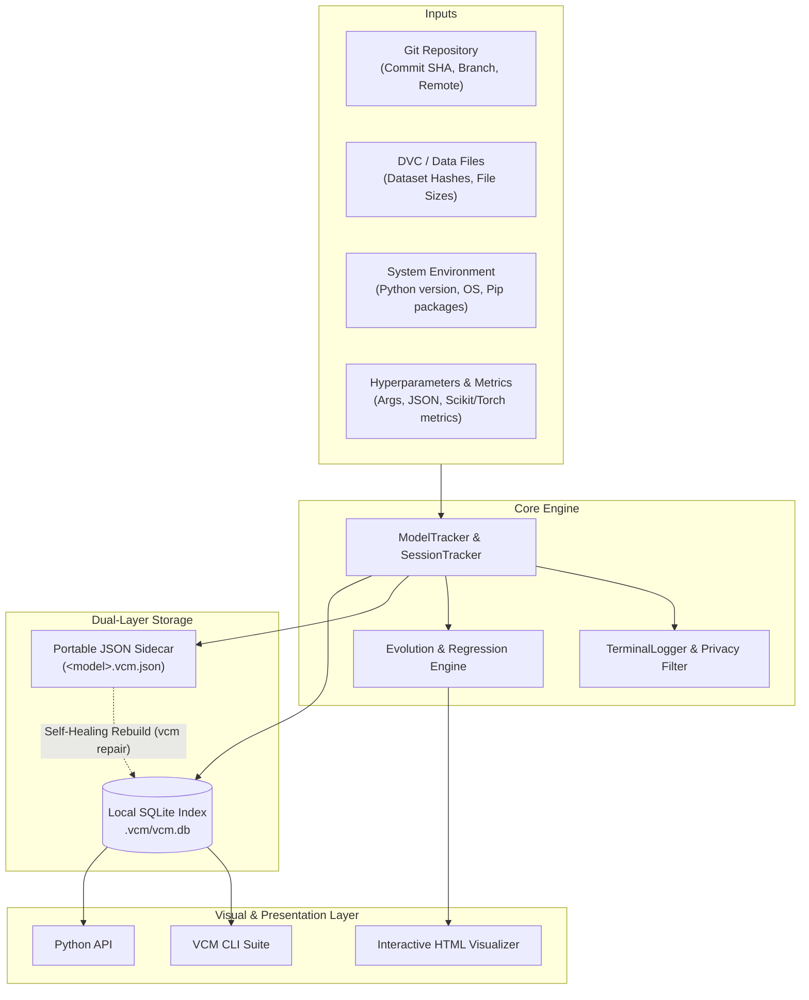

# VCM System Architecture & Design

This document details the architectural blueprint, data flow models, database schemas, and design principles behind **VCM (Version Control Models)**.

---

## 1. System Overview

VCM bridges the gap between software code management (**Git**) and data artifact tracking (**DVC**). Machine learning models exist at the intersection of code commits, data revisions, hyperparameters, execution environments, and evaluation metrics.



---

## 2. Core Architectural Principles

### 2.1 Dual-Layer Storage (Zero Vendor Lock-In)
- **Immutable JSON Sidecars (`<model>.vcm.json`)**: Every saved model artifact has an accompanying metadata sidecar. It moves with the model across cloud buckets (S3, GCS, Azure Blob), local drives, or Git LFS.
- **Local SQLite Index (`.vcm/vcm.db`)**: High-performance indexed relational database optimized with Write-Ahead Logging (WAL) and index structures for sub-5ms queries over thousands of models.
- **Self-Healing Architecture**: The SQLite database is treated as an ephemeral cache index. If the database is deleted or corrupted, `vcm repair` scans the repository and reconstructs the index completely from sidecar files.

### 2.2 Model DNA Triangulation
Every model record deterministically links:
1. **Code**: Clean Git commit SHA, branch, and working tree cleanliness.
2. **Data**: DVC file hashes or SHA-256 file content hashes.
3. **Hyperparameters & Metrics**: Complete dictionary of inputs and outputs.
4. **Environment**: Exact Python minor version and pip freeze dependencies.
5. **Human Reasoning**: Developer intent, hypothesis, and regression rationale.

### 2.3 Transparent Privacy Masking
The `TerminalLogger` transparently intercepts stdout and stderr streams during development sessions. High-entropy API keys (OpenAI `sk-`, AWS `AKIA`, generic bearer tokens, private keys) are automatically masked with `***MASKED***` prior to storage.

---

## 3. Database Schema

VCM manages 5 relational tables within `.vcm/vcm.db`:

```sql
-- 1. Core Model DNA Catalog
CREATE TABLE IF NOT EXISTS models (
    id INTEGER PRIMARY KEY AUTOINCREMENT,
    model_name TEXT NOT NULL,
    model_file TEXT NOT NULL,
    model_hash TEXT UNIQUE,
    accuracy REAL,
    f1_score REAL,
    git_commit TEXT,
    git_branch TEXT,
    dataset_hash TEXT,
    training_timestamp DATETIME,
    created_at DATETIME DEFAULT CURRENT_TIMESTAMP,
    metadata_json TEXT NOT NULL
);
CREATE INDEX IF NOT EXISTS idx_model_name ON models(model_name);
CREATE INDEX IF NOT EXISTS idx_accuracy ON models(accuracy DESC);
CREATE INDEX IF NOT EXISTS idx_git_commit ON models(git_commit);
CREATE INDEX IF NOT EXISTS idx_dataset_hash ON models(dataset_hash);

-- 2. Training Sessions
CREATE TABLE IF NOT EXISTS sessions (
    id TEXT PRIMARY KEY,
    name TEXT NOT NULL,
    user TEXT,
    start_time TEXT NOT NULL,
    end_time TEXT,
    duration_seconds REAL,
    git_commits TEXT,
    models_count INTEGER DEFAULT 0,
    best_model_id TEXT,
    best_accuracy REAL,
    terminal_log TEXT,
    status TEXT DEFAULT 'active',
    data_json TEXT NOT NULL
);

-- 3. Session Annotations
CREATE TABLE IF NOT EXISTS session_annotations (
    id INTEGER PRIMARY KEY AUTOINCREMENT,
    session_id TEXT NOT NULL,
    timestamp TEXT NOT NULL,
    note TEXT NOT NULL,
    category TEXT DEFAULT 'general',
    model_id TEXT,
    FOREIGN KEY (session_id) REFERENCES sessions(id)
);

-- 4. Session-to-Model Join Table
CREATE TABLE IF NOT EXISTS session_models (
    session_id TEXT NOT NULL,
    model_id TEXT NOT NULL,
    position INTEGER NOT NULL,
    PRIMARY KEY (session_id, model_id),
    FOREIGN KEY (session_id) REFERENCES sessions(id)
);

-- 5. Model Evolution & Progression Timeline
CREATE TABLE IF NOT EXISTS model_evolution (
    id INTEGER PRIMARY KEY AUTOINCREMENT,
    model_id TEXT UNIQUE NOT NULL,
    position INTEGER,
    previous_model_id TEXT,
    next_model_id TEXT,
    reasoning TEXT,
    session_id TEXT,
    git_commit TEXT,
    accuracy REAL,
    accuracy_delta REAL,
    created_at DATETIME DEFAULT CURRENT_TIMESTAMP
);
CREATE INDEX IF NOT EXISTS idx_evolution_position ON model_evolution(position);
CREATE INDEX IF NOT EXISTS idx_evolution_session ON model_evolution(session_id);
```

---

## 4. Progression & Regression Engine

The `TimelineStore` implements graph traversal and progression tracking:
1. **Lineage Chaining**: Each model is linked to its `previous_model_id` and `next_model_id`.
2. **Automated Delta Calculation**: Accuracy and metric deltas are computed dynamically:
   $$\Delta \text{accuracy} = \text{accuracy}_{t} - \text{accuracy}_{t-1}$$
3. **Regression Detection**: Any iteration where $\Delta \text{accuracy} < -\text{threshold}$ is flagged as a regression alert.
4. **Root Cause Diagnosis**: When a regression occurs, the engine compares:
   - Hyperparameters: Parameter additions, removals, or capacity shrinkage.
   - Code: Git diff between consecutive commit hashes.
   - Data: Differences in DVC dataset hashes.
5. **Gap Detection**: Detects development pauses where $\Delta t > 24\text{ hours}$.

---

## 5. Security Architecture

VCM operates locally with zero external network transmission required:
- **Zero Cloud Telemetry**: Everything resides in the local project workspace.
- **TeeStream Sanitization**: Captured terminal streams pass through regex tokenizers before hitting disk.
- **Deterministic Replay**: Models can be reproduced without exposing external credentials.
